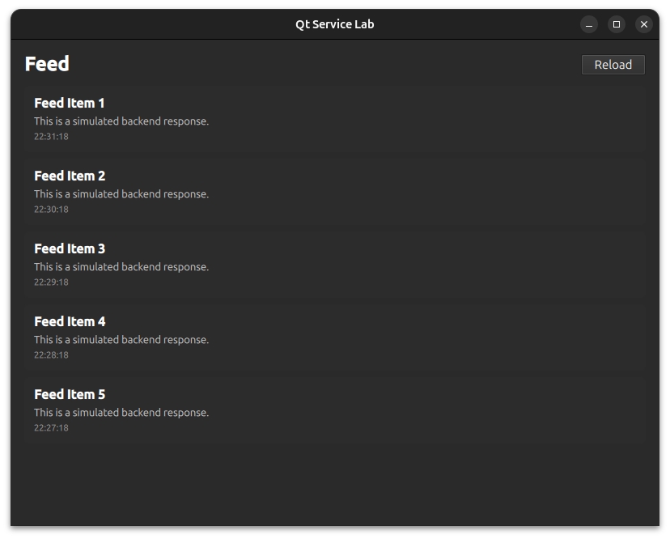

# Qt Service Lab

Qt Service Lab is a Qt 6/QML application demonstrating a clean separation of
concerns between UI, state management, data models, and service layers. The
project simulates a backend API using C++ to drive the UI asynchronously,
showcasing how to structure a Qt application with QAbstractListModel,
signals/slots, and state-driven QML.

## Screenshot



## Features

- Service Layer Simulation
    - `FakeApiService` simulates network latency, failures, and structed API responses.
- State Management
    - `AppState` exposes UI state (`loading`, `error`) to QML.
- List Models
    - `FeedModel` implements `QAbstractListModel` to provide dynamic feed data
    to the QML ListView
- Async Flow Handling
    - App`Controller` orchestrates service calls, updates the model, and manages
    error/loading states.
- Clean QML Integration
    - QML binds only to `AppState`, `FeedModel`, and `AppController`.
    - No business logic is implemented in QML.
- Error Handling
    - Reusable `ErrorBanner` component with a Retry button.
- Loading Indicator
    - `LoadingOverlay` displays while async operations are in progress.
- Keyboard shortcuts
    - `Esc` to quit
    - `Alt + Enter` to toggle fullscreen

## Project Structure

```bash

QtServiceLab/
│
├── src/
│   ├── app/
│   │   ├── AppState.h/.cpp
│   │   └── AppController.h/.cpp
│   ├── services/
│   │   ├── FakeApiService.h/.cpp
│   │   └── ServiceTypes.h
│   ├── models/
│   │   ├── FeedItem.h
│   │   └── FeedModel.h/.cpp
│   └── main.cpp
│
├── qml/
│   ├── Main.qml
│   ├── screens/
│   │   └──FeedScreen.qml
│   └── components/
│       ├── LoadingOverlay.qml
│       └── ErrorBanner.qml
│
├── CMakeLists.txt
└── README.md
```

## Getting Started

**Prerequisites**
- Qt 6.x with QtQuick, QtQuick.Controls, and QtQuick.Layouts
- C++17 or newer
- CMake (if building with CMake) or Qt Creator

**Build Instructions**
1. Clone the repository:
```bash
git clone https://github.com/dtb1996/qt-service-lab.git
cd qt-service-lab
```
2. Open the project in Qt Creator:
    - `File → Open File or Project → select CMakeLists.txt`
3. Build and run the project.

## Usage

- Launch the app — a feed screen will appear.
- The feed will load automatically on startup (simulated delay).
- If the feed fails to load, an ErrorBanner is displayed.
- Click Retry to reload the feed.
- Use the Reload button in the header to manually refresh the feed.

## Learning Highlights

- Proper C++ → QML data binding using QQmlContext.
- Implementing QAbstractListModel for dynamic list views.
- Simulating async backend operations in a maintainable, testable way.
- Clean separation of state, controller, service, and UI layers.
- Reusable QML components with signal communication.
